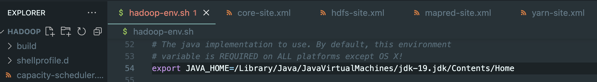
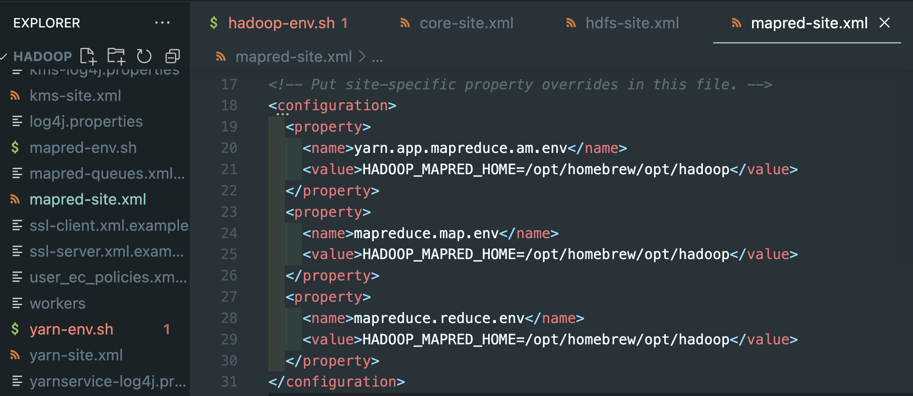
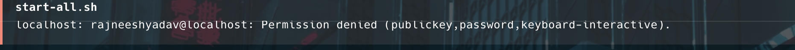

# Hadoop Installation on MacOS Step-by-Step Guide
This guide provides a comprehensive, step-by-step process to install and configure Hadoop on macOS. Follow the instructions carefully to ensure a smooth installation and setup.

### Prerequisites
Before installing Hadoop, make sure you have the following:

Homebrew installed. If not, install it here.

Java JDK (Java 8 or 11). Hadoop doesn't support newer versions. Install it using:
```bash
brew install openjdk@11
```
Set up the JAVA_HOME environment variable:


### Step 1: Install Hadoop via Homebrew
Run the following command to install Hadoop:
```bash
brew install hadoop
```

### Step 2:  Configure Environment Variables
Configure Environment Variables
Navigate to the Hadoop environment configuration file:
Open hadoop-env.sh using your preferred editor (example: vi,nano or VSCode)
```bash
cd /opt/homebrew/Cellar/hadoop/3.4.0/libexec/etc/hadoop
code .
```

In hadoop-env.sh, update the JAVA_HOME path:
```bash
export JAVA_HOME=/Library/Java/JavaVirtualMachines/jdk-19.jdk/Contents/Home
```


### Step 3: Configure Core Files

```core-site.xml```
Add the following configuration for HDFS:
```bash
<configuration>
  <property>
    <name>fs.defaultFS</name>
    <value>hdfs://localhost:9000</value>
  </property>
</configuration>
```


### Step 4: Configure HDFS Files
```hdfs-site.xml```
Add the following configuration to set replication:
```bash
<configuration>
  <property>
    <name>dfs.replication</name>
    <value>1</value>
    <name>dfs.webhdfs.enabled</name>
    <value>true</value>
  </property>
</configuration>
```


### Step 5: Configure MapReduce Files
```mapred-site.xml```
Add the following configuration:
```bash
<configuration>
  <property>
    <name>mapreduce.framework.name</name>
    <value>yarn</value>
  </property>
  <property>
    <name>mapreduce.application.classpath</name>
    <value>
      $HADOOP_MAPRED_HOME/share/hadoop/mapreduce/*:
      $HADOOP_MAPRED_HOME/share/hadoop/mapreduce/lib/*
    </value>
  </property>
</configuration>
```


### Step 6: Configure YARN Files
```yarn-site.xml```
Add the following configuration:
```bash
<configuration>
  <property>
    <name>yarn.nodemanager.aux-services</name>
    <value>mapreduce_shuffle</value>
  </property>
  <property>
    <name>yarn.nodemanager.env-whitelist</name>
    <value>
      JAVA_HOME,HADOOP_COMMON_HOME,HADOOP_HDFS_HOME,HADOOP_CONF_DIR,
      CLASSPATH_PREPEND_DISTCACHE,HADOOP_YARN_HOME,HADOOP_MAPRED_HOME
    </value>
  </property>
</configuration>
```


**Once all the configurations are done, start all Hadoop services:**
```bash
start-all.sh
```
If you encounter any error like



Then, you have to run these following commands:

- Stop all running services:
  ```bash
  stop-all.sh
  ```
- Generate an SSH key if you don’t have one (skip this if you already have a ssh key setup on your computer):
  ```bash
  ssh-keygen -t rsa -P ''
  ```

- Authorize SSH keys:

 ```bash
 cat ~/.ssh/id_rsa.pub >> ~/.ssh/authorized_keys
 ```
- Format the Hadoop NameNode:

 ```bash
 hadoop namenode -format
```


Start Hadoop services again:

```bash
start-all.sh
```


### Step 8: Verify Hadoop Processes
To verify that all processes are running correctly, run:
```bash
jps
```


You should see services like NameNode, DataNode, ResourceManager, and NodeManager listed.

Now, go to http://localhost:9870


### To create and list a folder in HDFS use the following command-
```bash
hadoop fs -mkdir /user/dataTeam
hadoop fs -ls /user
```


### To put a file from the local system to an HDFS directory, use the following command:
```bash
hadoop fs -put /local/path/to/file /hdfs/path/to/directory
```


**Validate HDFS Storage Check if the HDFS is functioning correctly and if there's enough storage space available. Use the following command to view the storage report:**
```bash
hadoop dfsadmin -report
```


**Check HDFS Health**
Run the command to see if there are any underlying issues with HDFS. Check for any corrupt blocks or under-replicated blocks:
```bash
hadoop fsck /
```


### Conclusion
You have successfully installed and configured Hadoop on macOS. Now you can start using Hadoop for your big data processing needs.


